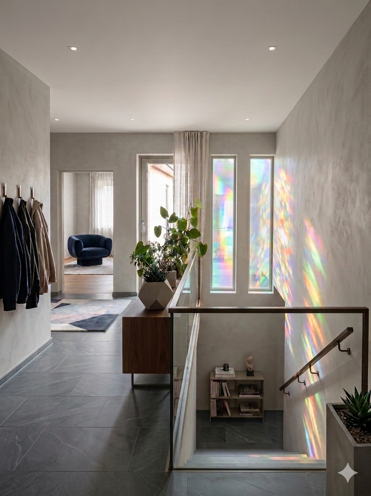

# Planung: Flur

## 📏 BASISDATEN
- Fläche: 12,25 m² (laut Grundriss)
- Status: In Planung

## 💡 ELEKTRO-PLANUNG (MATERIALKOSTEN)
| Posten | Menge | Einheit | Einzelpreis | Gesamtpreis |
| :--- | :--- | :--- | :--- | :--- |
| LED Einbauspots (warmweiß, dimmbar) | 6 (3x Eingang, 3x Flur) | Stk. | 45,00 € | 270,00 € |
| NYM-J 3x1,5 mm² Kabel | 25 | m | 1,20 € | 30,00 € |
| Einbaudosen & Klemmen | 1 | Set | 35,00 € | 35,00 € |

## 🖼️ INSPIRATION

- **Konzept:** Nutzung von schmalen Fensterausschnitten für Lichteffekte (z.B. Regenbogenfolie oder Prismen-Effekt).
- **Materialität:** Warme Betonoptik an den Wänden kombiniert mit dunklem Steinboden.
- **Akzente:** Minimalistisches Lichtdesign und offener Treppenaufgang.

## 🛠️ AUSFÜHRUNG
- [ ] Deckenausschnitt erstellen
- [ ] Verkabelung zu den Brennstellen ziehen
- [ ] Dimmer im Schalterprogramm integrieren
